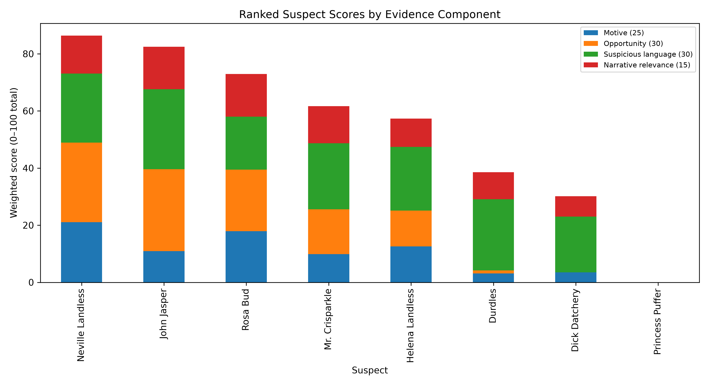
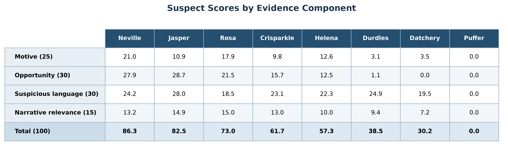
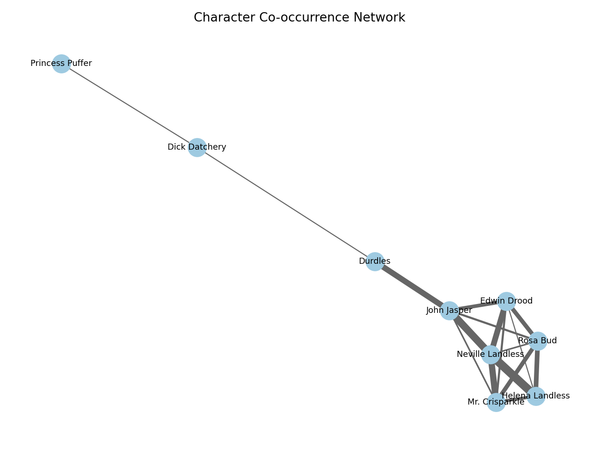
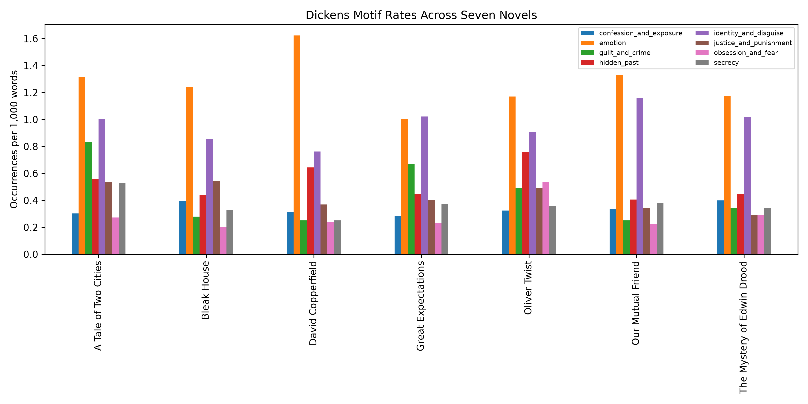

# Who Killed Edwin Drood? An NLP Investigation

## Method

The Project Gutenberg text was stripped of boilerplate and divided into 23 chapters, paragraphs, and sentences. Alias rules tracked nine main characters. The analysis measured character frequency, chapter presence, paragraph co-occurrence, frequent contextual words, sentiment, and suspicious language.

Suspects were scored on four normalized components: motive (25 points), opportunity (30), suspicious language (30), and semantic narrative relevance (15). Sentence embeddings retrieved clue candidates for motive, means, opium/double life, behavior after the disappearance, survival/disguise, and the Neville false-suspect theory. TF-IDF/K-means clustered scenes, and twelve final passages were audited against the source text.

## Suspects and clues

**Interpretive finding: John Jasper, not Neville Landless, is the primary suspect.** The 3.9-point numerical gap is small, and Jasper leads Neville in opportunity, suspicious language, and narrative relevance. Neville wins the total only because the novel surrounds its conspicuous suspect with unusually explicit jealousy and conflict vocabulary. Jasper's evidence is less overt but forms a stronger cross-scene sequence of motive, preparation, possible means, concealment, and behavior after Edwin disappears.

The audited clue chain supporting **Jasper** is:

1. The opium-house figure later identified as Jasper acts out strangulation.
2. Jasper admits secret opium use and a divided life.
3. He makes an unexplained pre-disappearance survey of the cathedral and crypt with Durdles.
4. Durdles sleeps while Jasper has unexplained time near the loose crypt key.
5. Jasper confesses that he loved Rosa “madly” while she was promised to Edwin.
6. Rosa calls him false to Edwin and says his pursuit frightened her.
7. Jasper promptly insists that Edwin was murdered and vows secret revenge, positioning himself to control the inquiry.
8. Rosa later suspects Jasper; Grewgious distrusts him and observes torn, muddy clothes.
9. Jasper becomes reticent, isolated, and fixed on one purpose.
10. Crisparkle explicitly believes Neville innocent despite the accumulating circumstantial case.

## Dickens comparison

The comparison covers *Oliver Twist*, *Bleak House*, *David Copperfield*, *Great Expectations*, *Our Mutual Friend*, and *A Tale of Two Cities*. It measures eight motif families, ten-part sentiment arcs, opening/middle/ending motif progression, recurring character roles, and top-character co-occurrence networks.

In *Drood*, crime language rises from 0.101 per 1,000 words in the opening third to 0.740 in the surviving ending. Identity/disguise rises from 0.774 to 1.615, while secrecy rises from 0.235 to 0.471. Earlier Dickens novels repeatedly use hidden origins, socially embedded antagonists, apparent deaths, doubles, false assumptions, delayed exposure, and mysterious helpers. *Our Mutual Friend* is especially relevant because its protagonist survives under another identity; *Great Expectations* reverses the apparent meaning of a threatening stranger; and *A Tale of Two Cities* uses physical doubling and substitution.

These patterns do not prove a solution, but they support two inferences: Neville's overt guilt signals may be misdirection, and the late identity/disguise increase leaves room for Edwin's survival or a Datchery-centered revelation.

## Conclusion

**John Jasper is the strongest literary suspect, with medium confidence.** The model's narrow preference for Neville reflects highly visible accusation language; the broader evidence favors Jasper because it connects motive, possible method, preparation, access, secrecy, and suspicious post-disappearance behavior across several chapters. Neville has a deliberately obvious circumstantial case but also an explicit textual defender who believes him innocent.

Jasper probably attempted to kill Edwin, but completed murder cannot be established. No body or confession appears, Datchery's identity is unresolved, and Dickens's earlier identity/disguise patterns make survival plausible. NLP clarifies the distribution and progression of evidence; it cannot reconstruct Dickens's unwritten ending.

**Limitations:** The scores measure textual association, not intent or causation; alias matching and proximity-based opportunity can introduce errors. Cross-novel comparisons are affected by differences in length, cast, and structure, while *Drood* itself is incomplete. The analysis can rank theories and organize evidence, but it cannot prove a murder, identify a culprit with certainty, or recover Dickens's intended ending.
