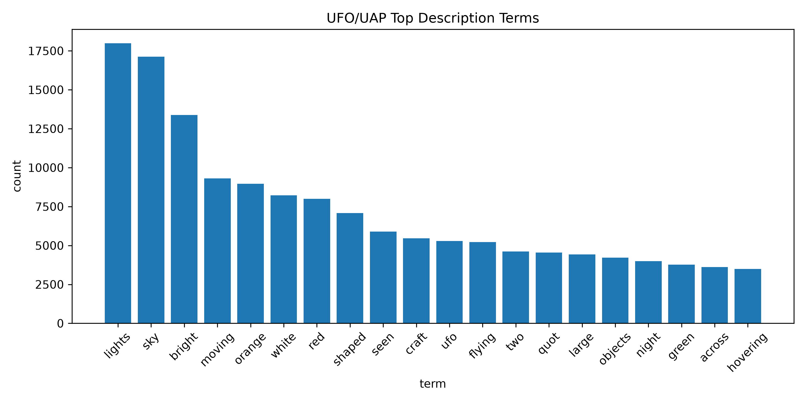
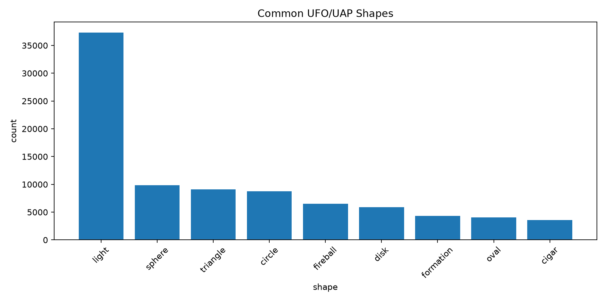
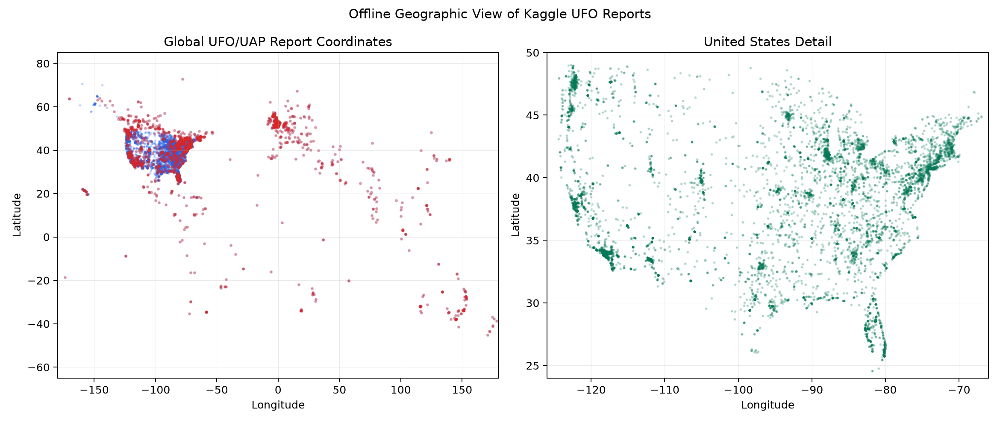

# UFO/UAP Sightings Across Civilian and Government Sources

## Data and exploration

This analysis combines 80,332 civilian Kaggle sightings with 223 PURSUE rows. The official collection includes all 175 downloaded text-bearing documents: 138 metadata-attached rows and 61 standalone documents from Releases 1–3, plus 24 metadata-only records. Text extraction, normalized shapes, common terms and phrases, lightweight spaCy NER, domain entities, temporal patterns, geographic patterns, and rare sightings were examined.

Civilian reports are dominated by visual vocabulary such as *lights*, *sky*, *bright*, *moving*, *orange*, *white*, and *red*. “Light” is also the most common normalized form, followed by sphere, triangle, circle, fireball, and disk. The geographic data is strongly concentrated in the United States, while the temporal series shows rapid growth in civilian reporting from the late 1990s through the early 2010s.

## Cross-source matching

Transformer embeddings were used for broad semantic retrieval because PURSUE date and location metadata is frequently missing, broad, or not clearly an incident date. Up to 120 Kaggle reports were retrieved for each usable PURSUE row. All 24,240 retrieved pairs then received detailed scoring using transformer similarity, TF-IDF cosine similarity, lexical overlap, date evidence, location evidence, and entity overlap. No minimum final-score threshold was applied; the pairs were globally sorted only after detailed scoring, and the top 500 were exported.

NER identifies people, organizations, geopolitical entities, facilities, dates, and events. UFO-specific lexicons add shapes, colors, motion, military terms, and structured source fields. PDF-derived date and location mentions are retained as review evidence rather than automatically asserted as incident metadata, because official documents may mention several events, publication dates, or administrative dates.

## Manual validation

The top 20 candidates were manually reviewed. Nineteen were classified as **possibly the same event**, and one was classified as **probably not the same event**. None had enough distinctive, reliable evidence to justify **likely the same event**.

Five representative cases illustrate the result:

1. **Kaggle 10290 / Western US Event:** Both describe orange/red orb-like lights, and Santa Cruz is compatible with the broad Western United States label. The description is plausible, but the official 2023 value cannot be established as the incident date and orb vocabulary is common.
2. **Kaggle 68270 / Incident Summaries 101–172:** The event sequence is semantically similar, but the official collection has no usable location or event date for the passage. Low direct TF-IDF and NER overlap prevent a stronger conclusion.
3. **Kaggle 26520 / Western US Event:** Orange/red orb characteristics match, but East Glastonbury, Connecticut conflicts with the Western United States label. The pair remains possible only because official dates and locations are not sufficiently reliable to prove or disprove identity.
4. **Kaggle 68579 / Incident Summaries 101–172:** This was classified as probably not the same event. The Kaggle report is from Mexico, the official location is absent, durations differ, and both TF-IDF and named-entity overlap are zero.
5. **Kaggle 19347 / USPER Statement:** Both concern orb-like phenomena, but “United States” is too broad and the official date is unavailable. This is a thematic lead rather than evidence of one event.

## Conclusion and limitations

The system found several plausible thematic correspondences, especially reports involving orange or red orbs, but insufficient date, location, and distinctive-event evidence prevents confidently establishing a cross-source duplicate. This is a substantive result rather than a processing failure: the publicly released PURSUE material does not contain enough specific incident metadata to resolve the uncertainty.

Transformer similarity was effective for retrieving comparable narratives. TF-IDF, NER, location, and cautious date evidence were most useful for showing when a high semantic score represented the same kind of sighting rather than the same historical occurrence. Remaining limitations include broad or missing public metadata, mixed date semantics, OCR noise, multi-incident historical documents, and generic vocabulary shared by unrelated sightings.

